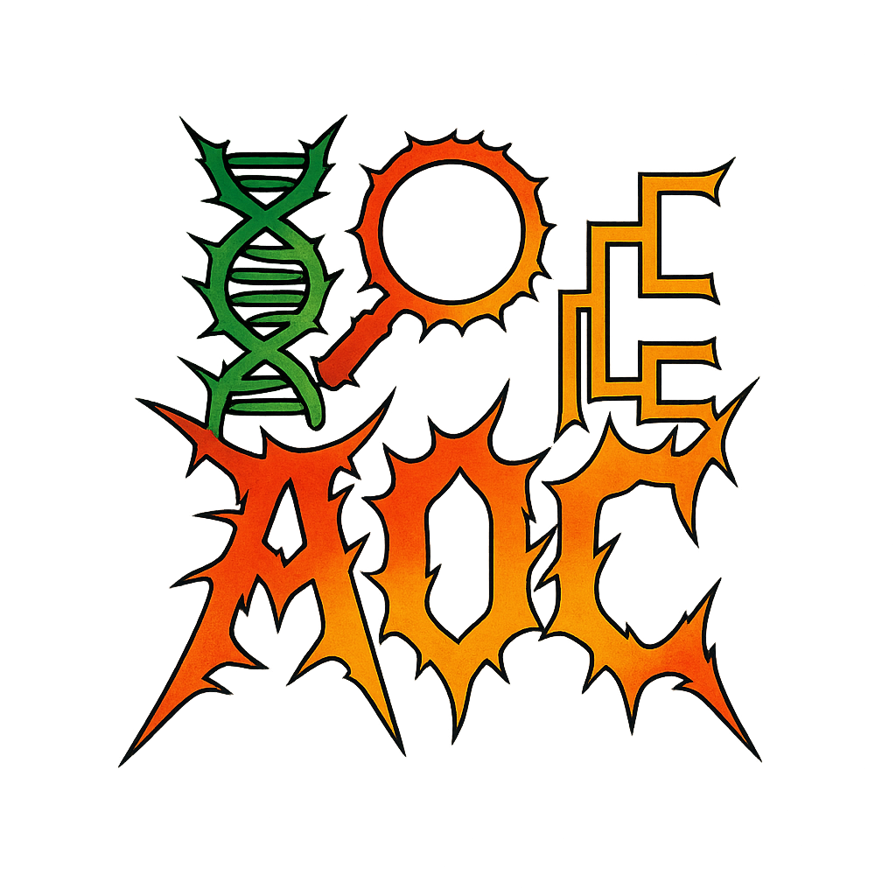

<p align="center">
  
</p>

# Analysis of Orthologous Collections (AOC)

[](https://github.com/aglucaci/Analysis-of-Orthologous-Collections/actions/workflows/test.yml)
[](https://github.com/aglucaci/Analysis-of-Orthologous-Collections/blob/main/LICENSE)
[](https://github.com/aglucaci/Analysis-of-Orthologous-Collections/commits/main)
[](https://github.com/aglucaci/Analysis-of-Orthologous-Collections/issues)
[](https://snakemake.readthedocs.io/)
[](https://www.python.org/)


**AOC** is a reproducible, Snakemake-based pipeline for the automated investigation of molecular evolution across orthologous protein-coding genes. It integrates high-throughput alignment, recombination detection, phylogenetic reconstruction, and a comprehensive suite of HyPhy-based selection analyses.

---

## Features

- Codon-aware multiple sequence alignment using **MACSE2**
- Recombination detection with **HyPhy GARD**
- Phylogenetic tree inference using **IQ-TREE**
- Comprehensive molecular evolution analysis via **HyPhy**:
  - Site-level: MEME, FEL, SLAC, FUBAR
  - Branch-level: aBSREL, BUSTED
  - Gene-wide: Model testing, RELAX
  - Co-evolution and heterogeneity: BGM, FMM
- Lineage assignment and tree annotation via **NCBI Taxonomy + ete3**
- Automated result summarization and visualization
- Compatible with local or HPC environments

---

## Directory Structure

```
AOC/
├── config/             # Configuration YAMLs and environment files
├── data/               # Example input datasets (e.g., PrimateACE2)
├── results/            # Output directory for all results
├── scripts/            # Custom helper scripts (taxonomy, annotation, summaries)
├── workflow/           # Snakemake rules and pipeline logic
├── run_AOC_Local.sh    # Run script for local machines
├── run_AOC_HPC.sh      # Run script for SLURM clusters
└── README.md
```

---

## Installation

We recommend using **conda** for environment management.

```bash
conda env create -f config/environment.yml
conda activate AOC
```

---

## Input Requirements

Each dataset should include:
- A protein FASTA file of orthologs
- A matching transcript FASTA file
- A metadata CSV file with RefSeq accessions

Example:

```
data/PrimateACE2/
├── ACE2_orthologs.csv
├── ACE2_refseq_protein.fasta
└── ACE2_refseq_transcript.fasta
```

---

## Running the Pipeline

### Local Execution (For a single gene)

```bash
bash run_AOC_Local.sh data/PrimateACE2
```

### Local Execution (Multiple genes at a time)

```bash
bash run_AOC_Local.sh data/PrimateACE2
```

### HPC Execution (SLURM)

```bash
bash run_AOC_HPC.sh data/PrimateACE2
```

---

## 📊 Output

All results are saved to `results/<GENE>/` and include:
- Codon alignments
- Phylogenetic trees (`.treefile`)
- JSON and CSV summaries from each HyPhy method
- Annotated trees with NCBI taxonomic metadata
- Visual summaries of sites under selection (`Visualization/`)
- Summary statistics and results in CSV-Format (`Tables/`)

---

## 📚 Methods Summary

| Method   | Purpose                                  | Scale         |
|----------|------------------------------------------|----------------|
| FEL      | Pervasive site-level selection (ML)      | Site           |
| SLAC     | Fast site-level selection (counting)     | Site           |
| MEME     | Episodic (branch-specific) selection     | Site           |
| FUBAR    | Bayesian site-level selection            | Site           |
| aBSREL   | Adaptive branch-level selection          | Branch         |
| BUSTED   | Gene-wide episodic positive selection    | Gene/Branch    |
| RELAX    | Tests relaxation/intensification of ω    | Lineage        |
| BGM      | Detects co-evolving sites                | Site-pair      |
| FMM      | Finite mixture model of site classes     | Site           |

---

## 🧪 Example Use Case

We include a case study on **primate ACE2** evolution:

```bash
bash run_AOC_Local.sh data/PrimateACE2
```

This generates:
- Site-level selection maps
- Annotated phylogenetic trees
- Tables of positively selected sites across species
- Lineage-specific selection comparisons

---

## 📖 Citation

If you use AOC in your work, please cite:

> Lucaci AG, Pond SLK. AOC: Analysis of Orthologous Collections - an application for the characterization of natural selection in protein-coding sequences. ArXiv [Preprint]. 2024 Jun 13:arXiv:2406.09522v1. PMID: 38947939; PMCID: PMC11213150.

---

## 📬 Contact

Created and maintained by **Alexander G. Lucaci**  
Questions? Feature requests? Open an [issue](https://github.com/aglucaci/Analysis-of-Orthologous-Collections/issues) or contact [agl4001@med.cornell.edu](mailto:agl4001@med.cornell.edu)

---

## 📄 License

This project is licensed under the **GNU General Public License v3.0 (GPL-3.0)**.

---
